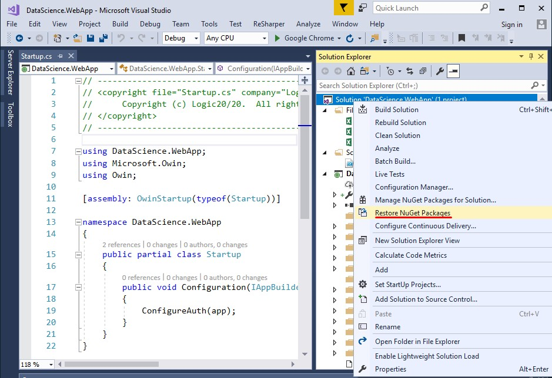
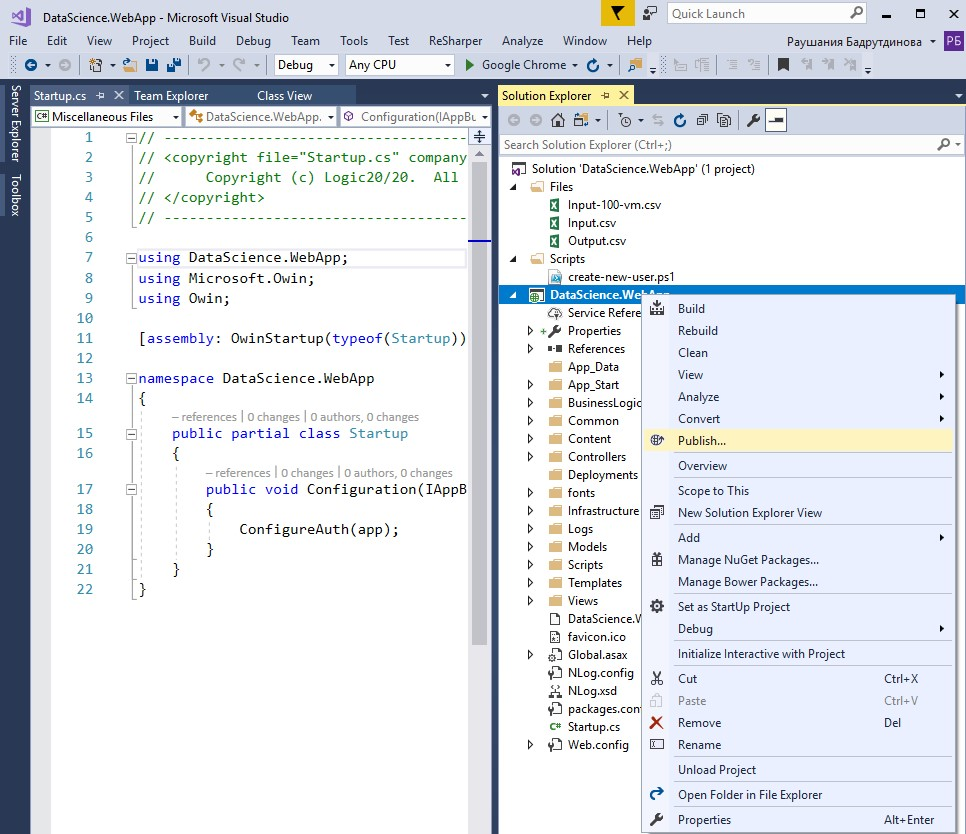
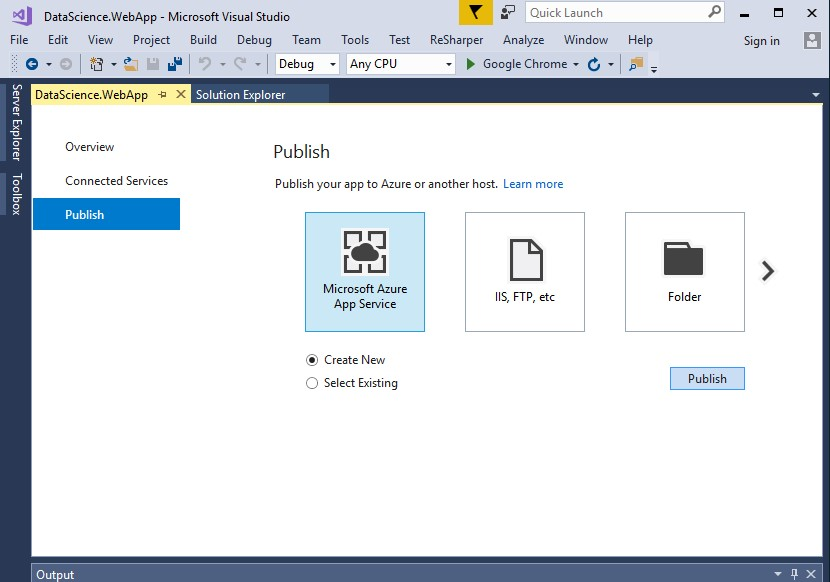
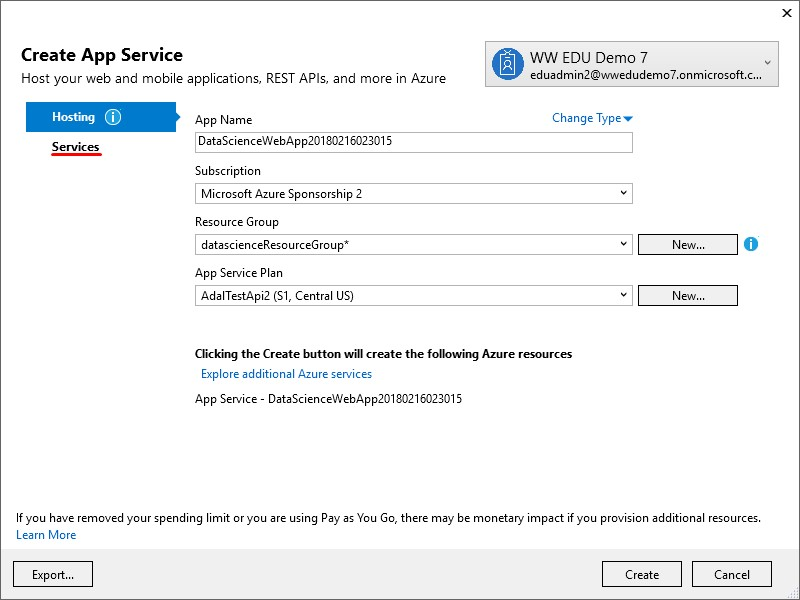
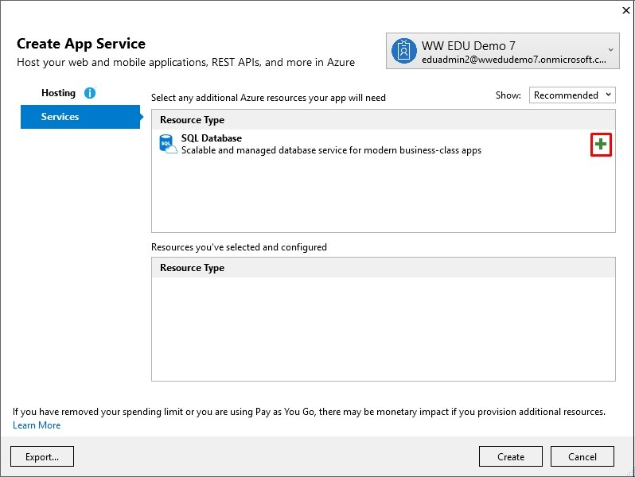
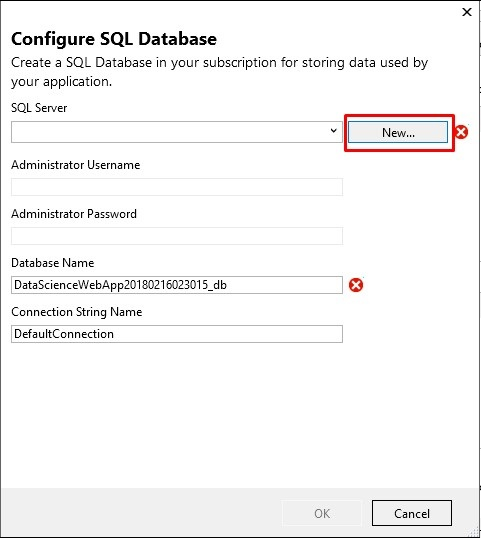
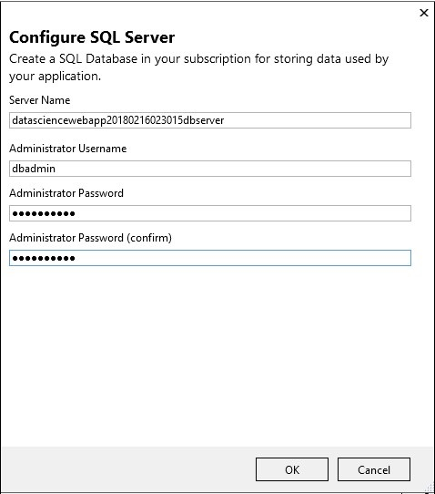
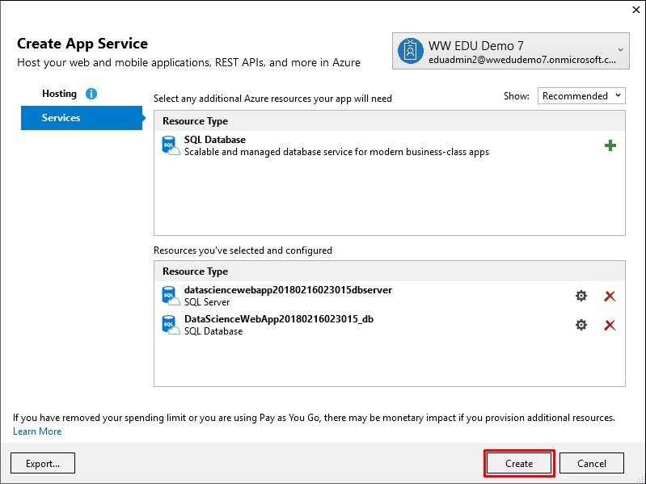
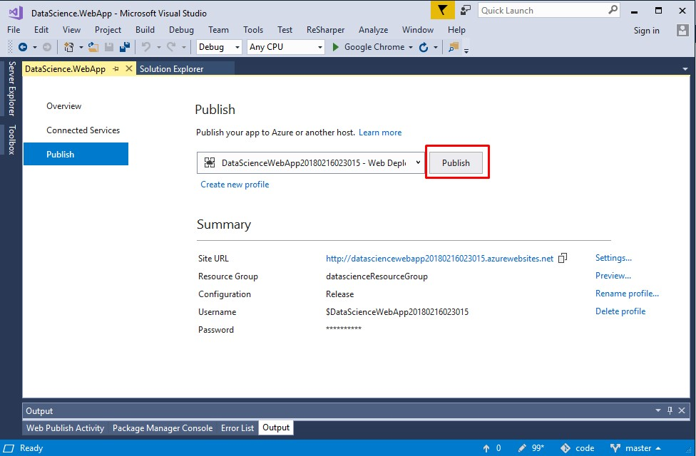
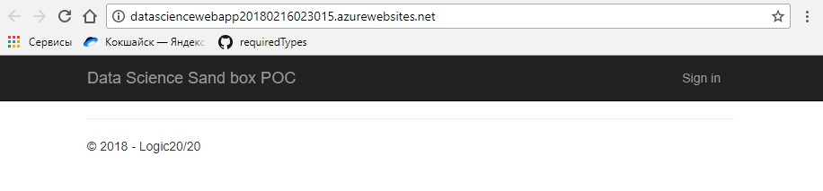

**DataSiense**

DataScience web application can be used to deploy Azure N-Series VMs.   

**Prerequisites**  

•	Windows 7/8/10  
•	Visual Studio 2015/2017  

<h2>Deployment</h2>

**Installation process:**
1.	To install application on your local machine clone project repository https://github.com/huzferd/DataScience.git or download and extract DataScience.zip file.
2.	Restore NuGet packages using “Restore NuGet packages” menu item and Solution context menu.

**Deploy application to Azure:**

1.	In Solution Explorer, right-click the DataScience.WebApp project and click “Publish”:

 
2.	In the “Publish” dialog window select “Microsoft Azure App Service” and click “Publish” button: 

3.	In the “Create App Service” dialog window:  
•	Enter your subscription.  
•	Input fields “App name”, “Subscription”, “Resource Group” and “App Service Plan” will be auto filled. You can save these names or change them.

 
4.	Click the “Services” tab to create the database.
5.	Select the green + icon to create the SQL database.

8. Click “New” in the “Configure SQL Database” dialog window to create the database.

 
9.	The “Configure SQL Server” dialog window appears. Enter the administrator user name and password, and then click OK. You can save the default server name.

 
10.	Click OK. Visual Studio returns the “Create App Service” dialog window.
11.	Click “Create” in the “Create App Service” dialog window.
 

Visual Studio creates a Web application and SQL Server in Azure. This may take a few minutes. After the deployment completes, click “Publish”. 

Visual Studio publishes the application in Azure. Once the deployment is complete, the application opens in the browser:

**Follow these steps to create a new VM:** 
1.	Sign in to the application with Azure Portal (https://portal.azure.com) account.

**Note:**  It is necessary to have IIS server configured on your computer  

**Software dependencies:**  
•	NLog 4.4.7  
•	EntityFramework 6.2.0  

**API references:** https://docs.microsoft.com/en-us/rest/api/

