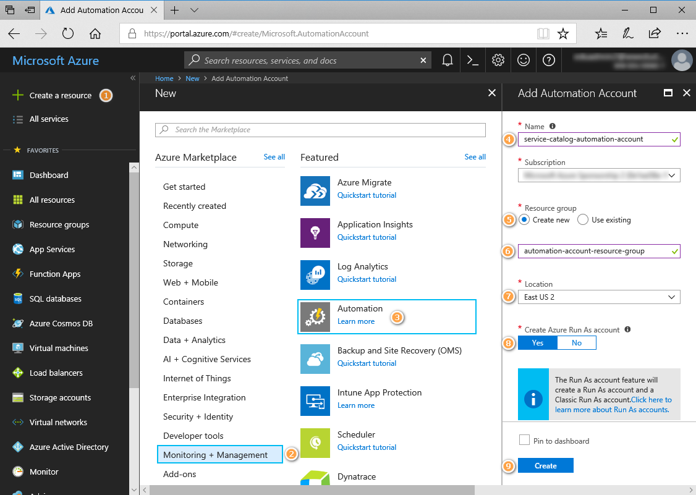
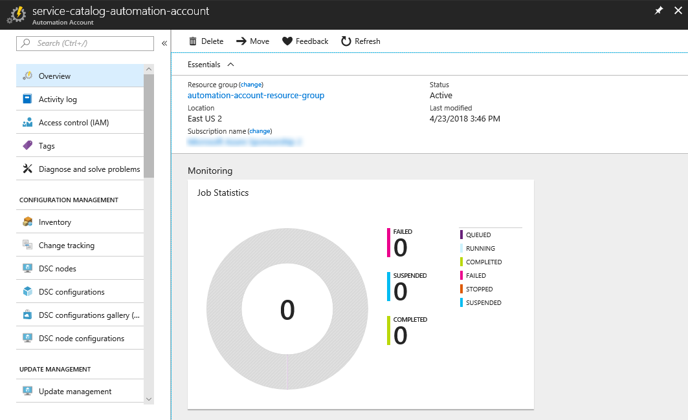

# Pre requirements

## Step 1: Install PowerShellGet

Installing items from the PowerShell Gallery requires the PowerShellGet module. Make sure you have
the appropriate version of PowerShellGet and other system requirements. Run the following command
to see if you have PowerShellGet installed on your system.
To update PowerShellGet, use the following command:

```powershell
Install-Module PowerShellGet -Force
```

## Step 2: Install Azure PowerShell

Installing Azure PowerShell from the PowerShell Gallery requires elevated privileges. Run the
following command from an elevated PowerShell session:

```powershell
# Install the Azure Resource Manager modules from the PowerShell Gallery
Install-Module -Name AzureRM -AllowClobber
```

```powershell
Untrusted repository
You are installing the modules from an untrusted repository. If you trust this repository, change its
InstallationPolicy value by running the Set-PSRepository cmdlet. Are you sure you want to install the modules from
'PSGallery'?
[Y] Yes  [A] Yes to All  [N] No  [L] No to All  [S] Suspend  [?] Help (default is "N"): A
```

Answer 'Yes' or 'Yes to All' to continue with the installation.

## Step 3: Installing the Azure AD Module

The Azure AD Module is supported on the following Windows operating systems with the default version of Microsoft .NET Framework and Windows PowerShell: Windows 8.1, Windows 8, Windows 7, Windows Server 2012 R2, Windows Server 2012, or Windows Server 2008 R2.

To install the public preview release, use

```powershell
Install-module AzureADPreview
```

## Step 4: Create an Azure Automation account

Azure Automation accounts can be created through Azure. This method provides a browser-based user interface for creating and configuring Automation accounts and related resources. This quickstart steps through creating an Automation account and running a runbook in the account.

### Log in to Azure

Log in to Azure at https://portal.azure.com

### Create Automation account

1.  Click the **Create a resource** button found on the upper left-hand corner of Azure.

1.  Select **Monitoring + Management**, and then select **Automation**.

1.  Enter the account information. Specify fileds:

    * **Account Name** - `service-catalog-automation-account`
    * **Resource Group**, choose `Create new`
    * **Resource Group Name** - `automation-account-resource-group`
    * **Create Azure Run As account**, choose **Yes** so that the artifacts to simplify authentication to Azure are enabled automatically. When complete, click **Create**, to start the Automation account deployment.

    

1.  The Automation account is pinned to the Azure dashboard. When the deployment has completed, the Automation account overview automatically opens.

    

## Download Script

1.  Open https://github.com/huzferd/servicecatalog, click `Clone or Download` and click `Download`
2.  Extract `servicecatalog-master.zip` and change directory to `Scripts`

## Create Service Account

To display help information, run this command:

```powershell
Get-Help .\create-service-account.ps1
```

Run PowerShell as administrator and execute the following command:

```powershell
.\create-service-account.ps1 -subscriptionId "C57D7401-4409-4D74-A6DD-346DC1C7F3A0" `
    -tenantId "ADFB12FE-F2F4-4820-8CF0-49E5AF4CC95C" `
    -siteName "YOUR_SITE_NAME" `
    -sitePassword "SERVICE_ACCOUNT_PASSWORD" `
    -azureAccountName "YOUR_AZURE_ACCOUNT_NAME" `
    -azureAccountPassword "YOUR_AZURE_ACCOUNT_PASSWORD"
```

[Getting your Azure Subscription GUID](https://blogs.msdn.microsoft.com/mschray/2016/03/18/getting-your-azure-subscription-guid-new-portal/)  
[Getting your Azure Tenant GUID](https://support.office.com/en-us/article/find-your-office-365-tenant-id-6891b561-a52d-4ade-9f39-b492285e2c9b)

# Deploy to Azure

[](https://azuredeploy.net/)
[](http://armviz.io/#/?load=https://raw.githubusercontent.com/huzferd/servicecatalog/master/azuredeploy.json)

---
